# LoreEngine — Complete Gameplay Walkthrough

> A step-by-step guide from first-time registration to full gameplay, with screenshots of every stage.

---

## 1. Landing Page

When you first visit LoreEngine, you see the home page with the game's title banner and a call to action. The sidebar shows limited options — only **Bestiary** and authentication links are available to unauthenticated users.

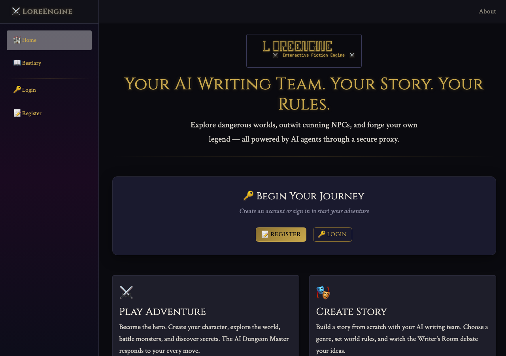

---

## 2. Create Your Account

Click **📝 Register** in the sidebar to create your adventurer's account.

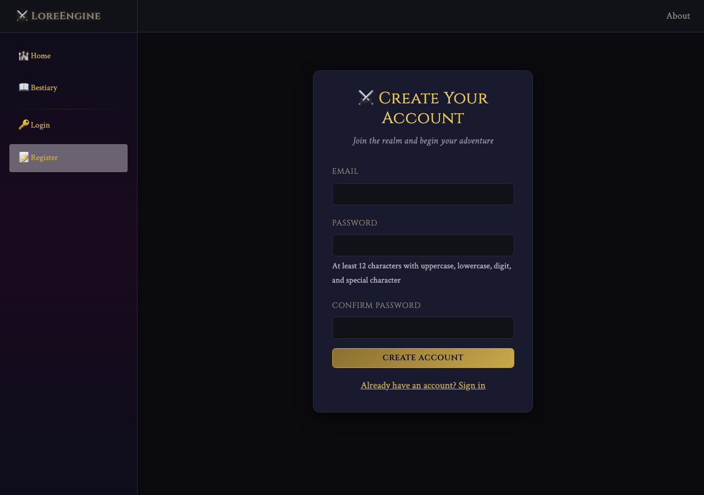

---

## 3. Fill In Your Credentials

Enter your email address and choose a strong password (minimum 12 characters with uppercase, lowercase, digit, and special character). Confirm your password and click **Create Account**.

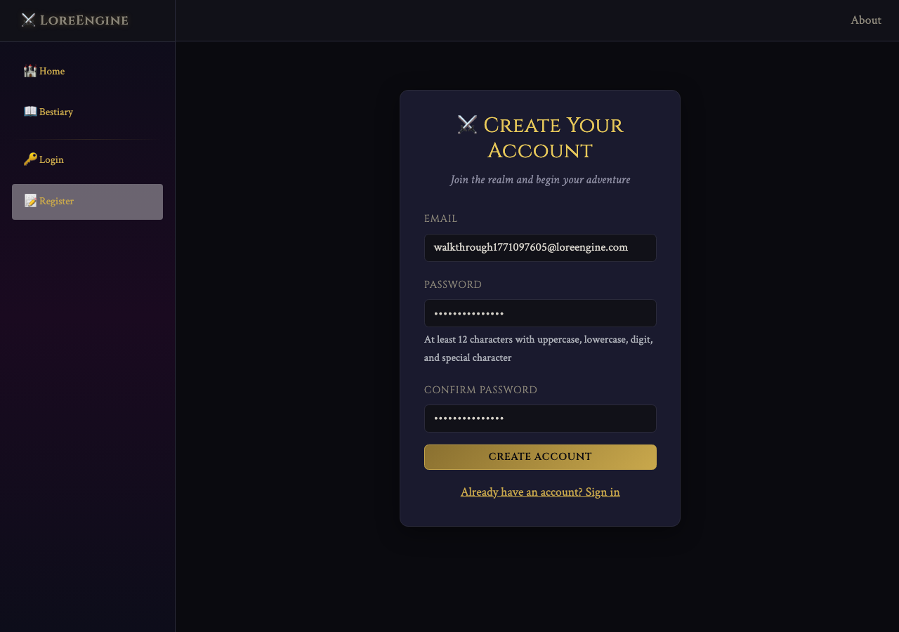

---

## 4. Character Creation

After registration, you're automatically logged in and redirected to the **Play** page. The sidebar now shows the full navigation: Play, Journal, Bestiary, Achievements, Create Story, Writers Room, and Chat.

The character creation screen welcomes you to the LoreEngine with an ASCII-art banner. Enter your character's name and choose a class.

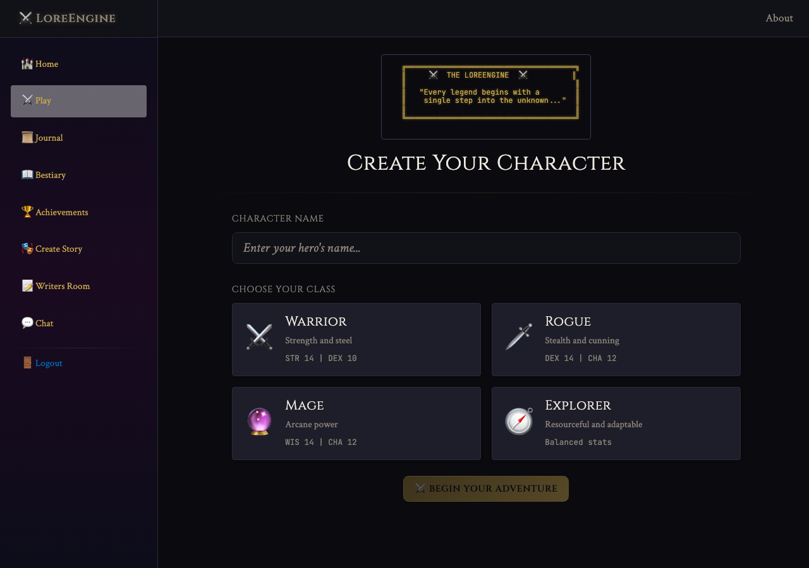

---

## 5. Name Your Character

Type your character's name. Choose something that fits the fantasy setting — names like "Thorn Ironforge" or "Elara Moonwhisper" work well. Names are limited to 30 characters.

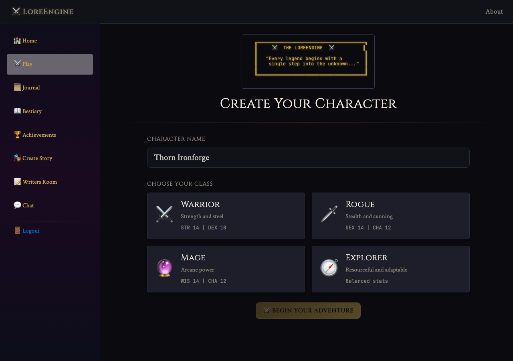

---

## 6. Choose Your Class

Select one of four classes, each with unique starting stats and equipment:

| Class | Bonus Stats | Starting Equipment |
|-------|-------------|-------------------|
| ⚔️ **Warrior** | STR 14, DEX 10 | Iron Sword, Leather Shield |
| 🗡️ **Rogue** | DEX 14, CHA 12 | Twin Daggers, Lockpicks |
| 🪄 **Mage** | WIS 14, CHA 12 | Oak Staff, Spellbook |
| 🧭 **Explorer** | Balanced | Walking Stick, Traveler's Map |

All classes start with 2× Healing Potions, 100 HP, 10 gold, and Level 1.

---

## 7. Begin Your Adventure

Click **Begin Your Adventure** to start the game! You arrive at **The Crossroads** — the central hub of the world. The game UI shows:

- **Status bar** — Character name, class, level, HP bar, gold, XP, and current location
- **Narrative area** — The AI Dungeon Master describes your surroundings
- **Action input** — Type what you want to do, or use quick-action buttons
- **Inventory panel** — Your equipment and items (right side)
- **Stats panel** — Your ability scores (right side)

Quick-action buttons include: 👁 LOOK, 🎒 INVENTORY, 💬 TALK, 🔍 SEARCH, 💤 REST, 🌀 TWIST, ⚔ FIGHT, 👁 ORACLE, and 🗺 MAP.

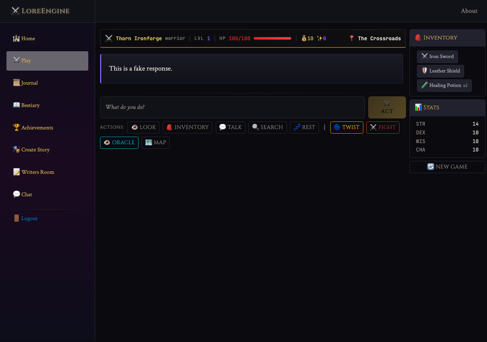

---

## 8. Explore: Look Around

Type a command like *"I carefully look around, examining my surroundings"* and click **ACT**. The AI Dungeon Master responds with a description of what you see. The game uses a dice-roll system behind the scenes — you may see dice check results appear as badges above the narrative.

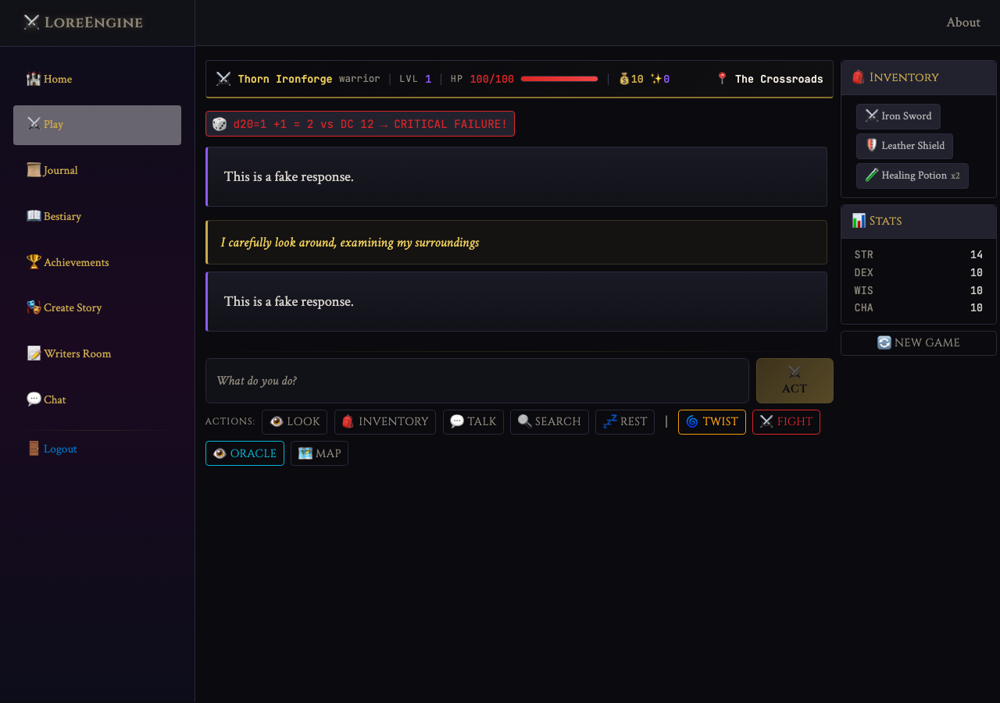

---

## 9. Travel: Move to a New Location

Type *"I head north into the Dark Forest"* to travel. The game supports multiple connected locations:

- **The Crossroads** → Dark Forest, Village of Thornwall, Mountain Path, Swamp of Sorrows
- **Dark Forest** → The Crossroads, Ruins of Aldenmere, Goblin Caves
- And many more...

Use the **🗺 MAP** button to see all discovered locations and available connections.

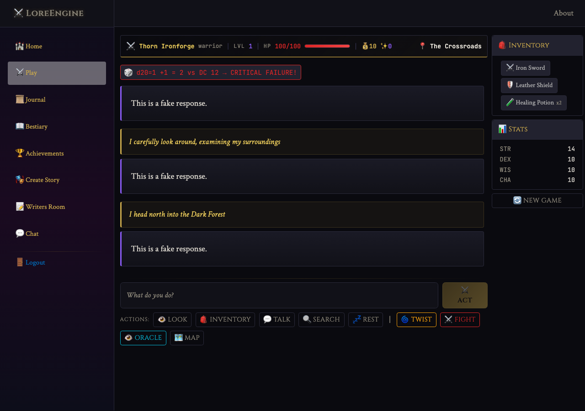

---

## 10. Search for Treasure

Type *"I search the area for hidden treasure or useful items"* to search. Search actions trigger a **Wisdom check** (d20 + modifier vs. difficulty class). On success, you may find gold, items, or hidden passages.

The dice check badge shows the roll result: `d20=X +modifier = total vs DC Y → Success/Failure`.

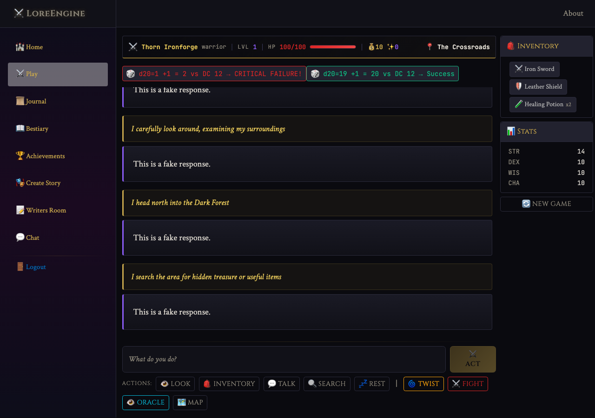

---

## 11. Combat

Type *"I attack the nearest enemy with my Iron Sword!"* to initiate combat. Combat uses the dice-roll system:

- **Attack rolls** — d20 + STR/DEX modifier vs. enemy's defense DC
- **Critical Success** — Rolling a natural 20 always succeeds
- **Critical Failure** — Rolling a natural 1 always fails (shown in red)
- **Success** — Total meets or exceeds the DC (shown in green)

In this example, you can see multiple dice checks in a single combat exchange, including a critical failure (d20=1) and a successful attack (d20=19).

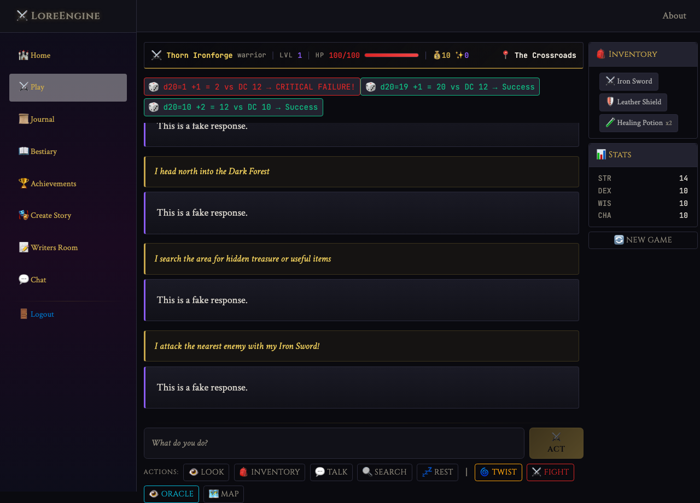

---

## 12. Browse the Bestiary

Visit the **📖 Bestiary** page to see all creatures you might encounter. Each creature card shows:

- Name, level, HP, and damage
- Description and special abilities
- Weakness and rewards (gold + XP)

Creatures range from Level 1 (Goblin Scout, Dire Rat) to high-level bosses (Crystal Golem, Wraith Lord, Swamp Hydra).

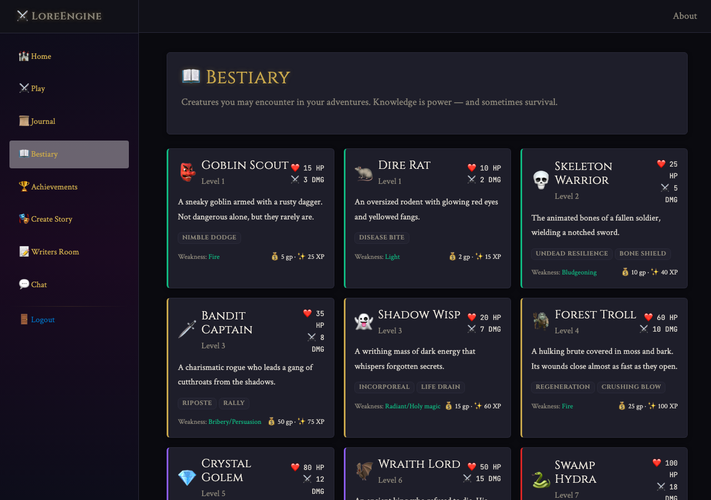

---

## 13. Review Your Journal

The **📜 Journal** page keeps a record of your adventure history — past sessions, significant events, and story progression.

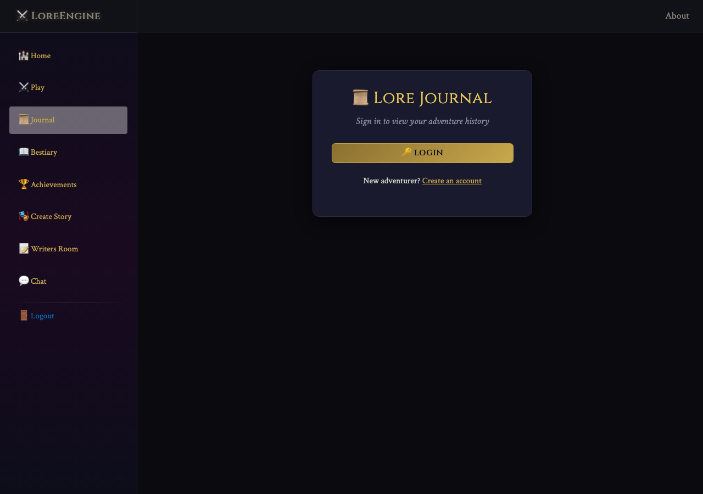

---

## 14. Free-Form Chat

The **💬 Chat** page offers a general-purpose AI chat interface, separate from the game. Use it to ask questions, discuss strategy, or have creative conversations.

---

## 15. Authenticated Home Page

After logging in, the home page updates to show your authenticated status with the full navigation menu, including all game features.

---

## Game Controls Reference

### Action Input
Type any action in natural language. The AI Dungeon Master interprets your intent and responds accordingly.

### Quick Actions
| Button | Effect |
|--------|--------|
| 👁 **LOOK** | Examine your surroundings |
| 🎒 **INVENTORY** | Check your items |
| 💬 **TALK** | Interact with NPCs |
| 🔍 **SEARCH** | Search for hidden items |
| 💤 **REST** | Rest to recover HP |
| 🌀 **TWIST** | Trigger a random plot twist |
| ⚔ **FIGHT** | Start a combat encounter |
| 👁 **ORACLE** | Ask the oracle a yes/no question |
| 🗺 **MAP** | View the world map |

### Dice System
All skill checks use a d20 + stat modifier vs. difficulty class (DC):
- **DC 8** — Easy
- **DC 10** — Moderate
- **DC 12** — Challenging
- **DC 15** — Hard
- **DC 18** — Very Hard
- **DC 20** — Nearly Impossible

### Leveling Up
Earn XP from combat, exploration, and quests. At each level, you need `Level × 100` XP to advance. Leveling up grants +10 max HP and full healing.

---

## Tips for New Players

1. **Explore everywhere** — Use LOOK and SEARCH in every new location
2. **Manage your health** — Use Healing Potions when HP drops below 50%
3. **Check the Bestiary** — Know creature weaknesses before fighting
4. **Use the Map** — Plan your route through the world
5. **Save your Oracle questions** — The oracle can reveal hidden information
6. **Try different classes** — Each class excels at different challenges
